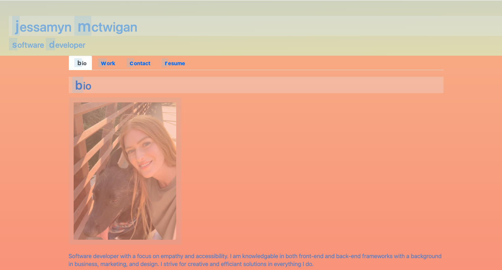
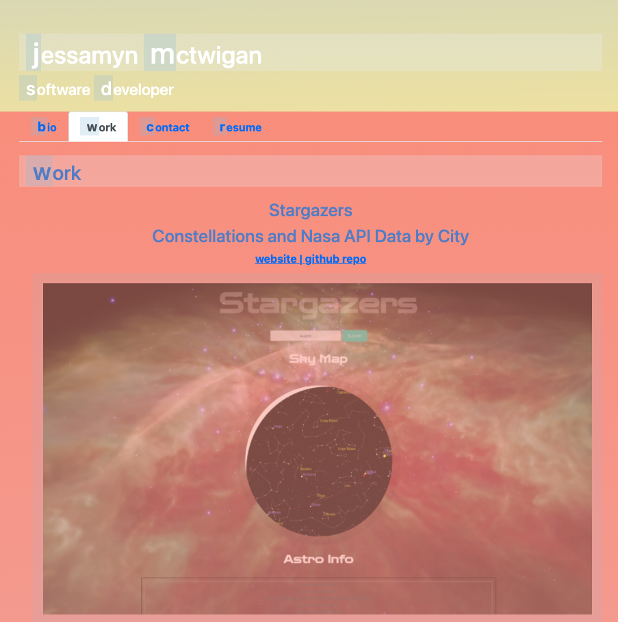
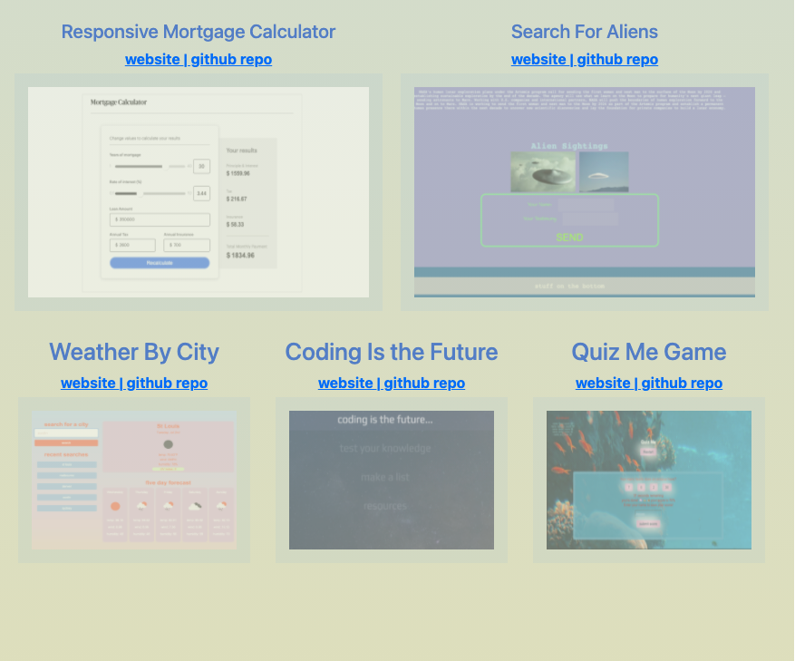
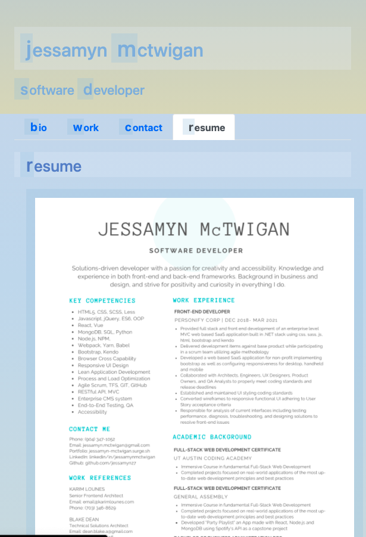
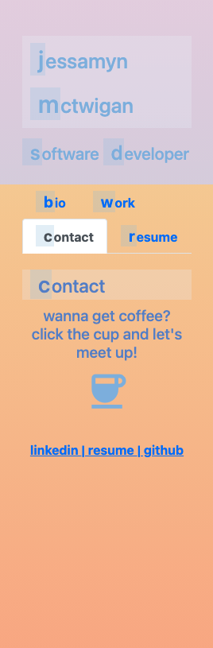

# Portfolio-React

#### Created a Personal Portfolio Website using react, express, css and responsve techniques like flexbox, @media and css selectors

## Table of Contents

**[Quick Links](#Quick-Links)**<br>
**[First Looks](#First-Looks)**<br>
**[Wireframes](#Wireframes)**<br>
**[Bugs and Known Issues](#Bugs-and-Known-Issues)**<br>
**[Next Steps to Continue](#Next-Steps-to-Continue)**<br>
**[Acceptance Criteria](#Acceptance-Criteria)**<br>
**[Bonus](#Bonus)**<br>
**[Deliverables](#Deliverables)**<br>
**[License](#License)**<br>

## Quick Links

- click here to view --> [final website](https://portfolio-jessamyn.herokuapp.com/#home)

- click here to view --> [README GUIDE from UT](https://github.com/the-Coding-Boot-Camp-at-UT/UTA-VIRT-FSF-FT-06-2021-U-LOL/blob/master/01-HTML-Git-CSS/02-Homework/Homework-Guide/README.md)


## First Looks

# 
# 
# 
# 
# 


## Wireframes - n/a


## Bugs and Known Issues

- More contact info and responsive UI clean up needed

## Next Steps to Continue

### Next Steps for App UI and Functionality

- More accessiblity like hover text info
- More browser compatibility css and @media queries to clean up some responsive scaling
- Add more accessibility (label ever form control / page lang idenity / all interactive elements keyboard accessible like sliders)
- Hover, Focus and other accessibilty standards need some tweaking
- test and clean up run time efficiency based on Google Analytics (organize acct structure / includes and excludes checklist ect..)
- Code Clean up CSS: set up global variables in SCSS for reusables (fonts, colors, headings and other elements ect...)
- Create more reusable classes and class combos in CSS as well as changing some classes to id's if only used once
- Set more standards for basic elements in CSS
- add Sass or Less structure that compiles to one CSS for code organizastion and better css nesting/functional variables 

### Next Steps for Code

```md
GIVEN a single-page application portfolio for a web developer
WHEN I load the portfolio
THEN I am presented with a page containing a header, a section for content, and a footer
WHEN I view the header
THEN I am presented with the developer's name and navigation with titles corresponding to different sections of the portfolio
WHEN I view the navigation titles
THEN I am presented with the titles About Me, Portfolio, Contact, and Resume, and the title corresponding to the current section is highlighted
WHEN I click on a navigation title
THEN I am presented with the corresponding section below the navigation without the page reloading and that title is highlighted
WHEN I load the portfolio the first time
THEN the About Me title and section are selected by default
WHEN I am presented with the About Me section
THEN I see a recent photo or avatar of the developer and a short bio about them
WHEN I am presented with the Portfolio section
THEN I see titled images of six of the developer’s applications with links to both the deployed applications and the corresponding GitHub repositories
WHEN I am presented with the Contact section
THEN I see a contact form with fields for a name, an email address, and a message
WHEN I move my cursor out of one of the form fields without entering text
THEN I receive a notification that this field is required
WHEN I enter text into the email address field
THEN I receive a notification if I have entered an invalid email address
WHEN I am presented with the Resume section
THEN I see a link to a downloadable resume and a list of the developer’s proficiencies
WHEN I view the footer
THEN I am presented with text or icon links to the developer’s GitHub and LinkedIn profiles, and their profile on a third platform (Stack Overflow, Twitter)
```

### Projects

For each project that is featured in your portfolio, include the following:

* An image of the deployed application (either a short animated GIF or screenshot)

* The title of the project

* A link to the deployed application

* A link to the corresponding GitHub repository

### Design

As with the previous portfolio homework, remember that "good" design is subjective; however, your site should look polished. Here are a few guidelines on what that means:

* Use mobile-first design.

* Choose a color palette that distinguishes your site from the default Bootstrap theme and unstyled HTML sites. Refer to resources like [Coolors](https://coolors.co/) or another color scheme generator to help you create something that will stand out.

* Ensure that the font size is large enough to read and that the colors don't cause eye strain.

* Consider using animations and React component libraries. Note that this will not affect your grade, but it might impact how potential employers gauge your knowledge.

## Grading Requirements

This homework is graded based on the following criteria:

### Technical Acceptance Criteria: 40%

* Satisfies all of the preceding acceptance criteria plus the following:

    * Application must use React to render content.

    * Application has a single `Header` component that appears on multiple pages, with a `Navigation` component within it that’s used to conditionally render About Me, Portfolio, Contact, and Resume sections.

    * Application has a single `Project` component that’s used multiple times in the Portfolio section.

    * Application has a single `Footer` component that appears on multiple pages.

    * Application must be deployed to GitHub Pages.

### Deployment: 32%

* Application deployed at live URL.

* Application loads with no errors.

* Application GitHub URL submitted.

* GitHub repository contains application code.

### Application Quality: 15%

* User experience is intuitive and easy to navigate.

* User interface style is clean and polished.

* Application uses a color scheme other than the default Bootstrap color palette.

### Repository Quality: 13%

* Repository has a unique name.

* Repository follows best practices for file structure and naming conventions.

* Repository follows best practices for class/id naming conventions, indentation, quality comments, etc.

* Repository contains multiple descriptive commit messages.

* Repository contains high-quality README file with description, screenshot, and link to deployed application.

## Review

You are required to submit BOTH of the following for review:

* The URL of the functional, deployed application.

* The URL of the GitHub repository, with a unique name and a README that describes the project.

### Bonus

- 1. Transpile JS for compatibility with other browsers (Safari/iOS)
- 2. Use of the Airbnb style guide
- 3. Unit tests for critical functions
- 4. Use JSDocs 3 pattern for comments
- 5. Write a list of bugs or known issues for your implementation if needed


### Deliverables

- 1. All source files (ES6 and SCSS)
- 2. HTML and CSS files (unminified)
- 3. GitHub repository link in UT Portal
- 4. Gitpages live website link in UT Portal

### License

[MIT License](https://opensource.org/licenses/MIT)


**[Back Up To Top](#Portfolio-React)**
